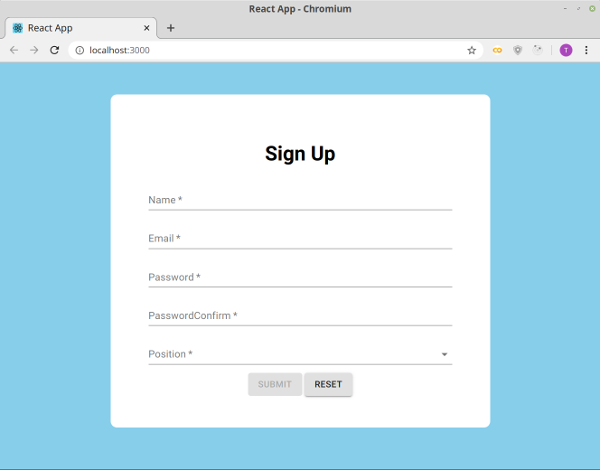

# Login page with Yup scheme validated by Formik, styled with material-ui

## Formik replaces React form component 
**Formik Field element handles onChange, onBlur, name, value from html input element.**
Formik Field element replaced:
* React state hook management as html input field value are handled.
* html onChange function as value changes are handled.

**Formik Yup validation**
Perform Yup validation
* isValid props return true when all validation passed.
* dirty props return true when all Formik initialValues objects visited.

**Formik onSubmit**
Formik onSubmit performed event.preventDefault() automatically and implicitly.
